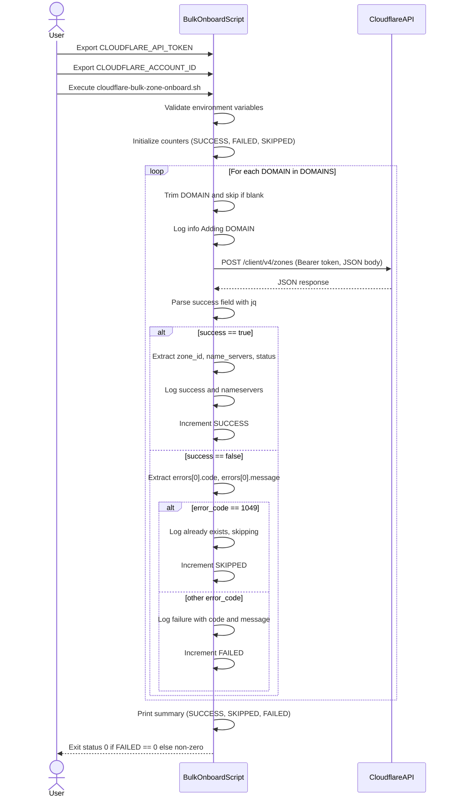

## Reviewer's Guide
Adds a new Bash utility script that bulk-onboards a configured list of domains as full zones to Cloudflare via its v4 API, with colored logging, jq-based response parsing, skip-on-existing behavior, and an aggregated success/skip/failure summary plus non-zero exit on hard failures.

#### Sequence diagram for the bulk Cloudflare zone onboarding script

#### Flow diagram for per-domain onboarding logic in the script
```mermaid
flowchart TD
    Start["Start domain processing"]
    GetDomain["Read DOMAIN from DOMAINS array"]
    Trim["Trim whitespace from DOMAIN"]
    BlankCheck{Is DOMAIN empty?}
    NextDomain["Skip to next DOMAIN"]
    LogInfo["Log info: Adding DOMAIN"]
    CallAPI["curl POST /client/v4/zones
    with JSON body and Bearer token"]
    ParseSuccess["Parse response.success with jq"]
    SuccessCheck{success == true?}
    ExtractResult["Extract zone_id,
    name_servers, status"]
    LogOK["Log success and nameservers"]
    IncSuccess["Increment SUCCESS counter"]
    ParseError["Extract first error
    code and message"]
    Error1049Check{error_code == 1049?}
    LogSkip["Log already exists, skipping"]
    IncSkipped["Increment SKIPPED counter"]
    LogFail["Log failure with code and message"]
    IncFailed["Increment FAILED counter"]
    End["End of DOMAINS loop"]

    Start --GetDomain --Trim --BlankCheck
    BlankCheck -->|Yes| NextDomain
    BlankCheck -->|No| LogInfo --CallAPI --ParseSuccess --SuccessCheck
    SuccessCheck -->|Yes| ExtractResult --LogOK --IncSuccess --NextDomain
    SuccessCheck -->|No| ParseError --Error1049Check
    Error1049Check -->|Yes| LogSkip --IncSkipped --NextDomain
    Error1049Check -->|No| LogFail --IncFailed --NextDomain
    NextDomain --End
```
### File-Level Changes
Bash script to bulk-onboard domains to Cloudflare as full zones via the Cloudflare API with robust logging and error handling.
* Read Cloudflare API token and account ID from required environment variables and configure API base URL, zone type, and free plan ID.
* Define a hard-coded list of domains to be onboarded, trimming whitespace and skipping empty entries during processing.
* Implement colored logging helpers for success, failure, and informational messages to improve script output readability.
* Loop over the domain list to POST zone-creation requests using curl, constructing JSON payloads with jq and parsing API responses.
* On successful responses, extract and display zone ID, nameservers, and status; on errors, inspect the first error code/message and treat code 1049 as a non-fatal already-exists skip.
* Maintain counters for added, skipped, and failed domains, print a final summary of results, and exit with a non-zero status if any non-skipped failures occurred.

`shell-based-utils/cloudflare-bulk-zone-onboard.sh`
Tips and commands
